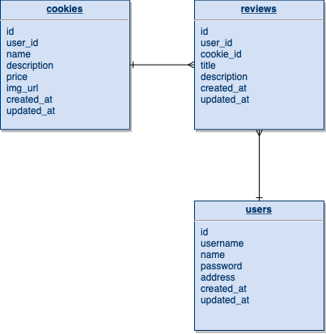

# cookieshoppe

- [Overview](#overview)
- [MVP](#mvp)
  - [Goals](#goals)
  - [Libraries and Dependencies](#libraries-and-dependencies)
  - [Client (Front End)](#client-front-end)
    - [Wireframes](#wireframes)
    - [Component Tree](#component-tree)
    - [Component Architecture](#component-architecture)
    - [Time Estimates](#time-estimates)
  - [Server (Back End)](#server-back-end)
    - [ERD Model](#erd-model)
- [Post-MVP](#post-mvp)
- [Code Showcase](#code-showcase)
- [Code Issues & Resolutions](#code-issues--resolutions)

<br>

## Overview

**cookieshoppe** is the best place to find the freshest virtual cookies in all of the web.

<br>

## MVP

_The **cookieshoppe** MVP includes Ruby on Rails on the backend with postgresql as the database. Backend contains routes to get, put, post, and delete cookies. The frontend will fetch data to render data for the menu items. There will be a delivery or pick up options and a checkout screen._

<br>

### Goals

- _Ruby on Rails backend with a cookie model_
- _Frontend with a mobile first design_
- _Working pseudo product checkout_
- _Styled website that looks nice in any screen_
- _UX friendly design that takes accesibility into consideration_

<br>

### Libraries and Dependencies

|    Library    | Description                                             |
| :-----------: | :------------------------------------------------------ |
|     React     | _Frontend library_                                      |
| React Router  | _Routing through the different screens on my frontend._ |
|     Redux     | State Management.                                       |
|     Axios     | _Frontend fetch request from my Backend._               |
| Ruby on Rails | _Backend framework._                                    |
|  PostgreSQL   | _Database._                                             |

<br>

### Client (Front End)

#### Wireframes


#### Component Tree


#### Component Architecture

```structure

src
|__ assets/
      |__ images
|__ components/
      |__ Header.jsx
      |__ Navbar.jsx
      |__ Splash.jsx
      |__ Menu.jsx
      |__ Payment.jsx
      |__ Bag.jsx
      |__ Checkout.jsx
|__ containers/
      |__ Home.jsx
      |__ Order.jsx
      |__ More.jsx
      |__ Layout.jsx
|__ screens/
      |__ Main.jsx
|__ services/
      |__ apiConfig.js
|__ utils/

```

#### Time Estimates

| Task                      | Priority | Estimated Time | Time Invested | Actual Time |
| ------------------------- | :------: | :------------: | :-----------: | :---------: |
| Readme                    |    H     |     3 hrs      |               |    3 hrs    |
| Backend - Models          |    H     |     3 hrs      |               |     TBD     |
| Backend - Seed            |    H     |     3 hrs      |               |     TBD     |
| Frontend - CRUD Functions |    H     |     3 hrs      |               |     TBD     |
| Frontend - Home Page      |    H     |     3 hrs      |               |     TBD     |
| Frontend - Order Page     |    H     |     6 hrs      |               |     TBD     |
| Frontend - More Page      |    L     |     3 hrs      |               |     TBD     |
| TOTAL                     |          |     24 hrs     |               |     TBD     |

<br>

### Server (Back End)

#### ERD Model


<br>

---

## Post-MVP

> Use this section to document ideas you've had that would be fun (or necessary) for your Post-MVP. This will be helpful when you return to your project after graduation!

---

## Code Showcase

> Use this section to include a brief code snippet of functionality that you are proud of and a brief description.

## Code Issues & Resolutions

> Use this section to list of all major issues encountered and their resolution.
