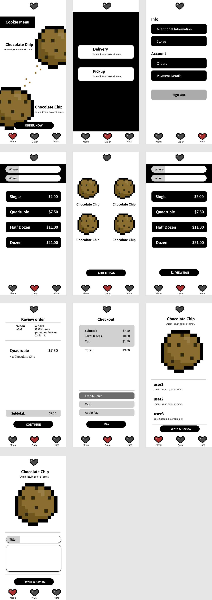

# cookieshoppe

- [Overview](#overview)
- [MVP](#mvp)
  - [Goals](#goals)
  - [Libraries and Dependencies](#libraries-and-dependencies)
  - [Client (Front End)](#client-front-end)
    - [Wireframes](#wireframes)
    - [Component Tree](#component-tree)
    - [Component Architecture](#component-architecture)
    - [Time Estimates](#time-estimates)
  - [Server (Back End)](#server-back-end)
    - [ERD Model](#erd-model)
- [Post-MVP](#post-mvp)
- [Code Showcase](#code-showcase)
- [Code Issues & Resolutions](#code-issues--resolutions)

<br>

## Overview

**cookieshoppe** is the best place to find the freshest virtual cookies in all of the web.

<br>

## MVP

> The Minimum Viable Product should be a well-planned, easily-communicated product, ensuring that the client's deliverable will be achievable and meet specifications within the time frame estimated.

_The **cookieshoppe** MVP includes Ruby on Rails on the backend with postgresql as the database. Backend contains routes to get, put, post, and delete cookies. The frontend will fetch data to render data for the menu items. There will be a delivery or pick up options and a checkout screen._

<br>

### Goals

- _Ruby on Rails backend with a cookie model_
- _Frontend with a mobile first design_
- _Working pseudo product checkout_
- _Styled website that looks nice in any screen_
- _UX friendly design that takes accesibility into consideration_

<br>

### Libraries and Dependencies

|    Library    | Description                                             |
| :-----------: | :------------------------------------------------------ |
|     React     | _Frontend library_                                      |
| React Router  | _Routing through the different screens on my frontend._ |
|     Redux     | State Management.                                       |
|     Axios     | _Frontend fetch request from my Backend._               |
| Ruby on Rails | _Backend framework._                                    |
|  PostgreSQL   | _Database._                                             |

<br>

### Client (Front End)

#### Wireframes




#### Component Tree

> Use this section to display the structure of how your React components are being rendered. This should show the parent to child relation between you components. In other words, show which components are rendering the other components. Include a link to your component tree

[Component Tree Sample](https://gist.git.generalassemb.ly/davidtwhitlatch/414107e2560ae0bb65e233570f2fe056#file-component-tree-png)

#### Component Architecture

> Use this section to define your React components and the data architecture of your app. This should be a reflection of how you expect your directory/file tree to look like.

```structure

src
|__ assets/
      |__ fonts
      |__ graphics
      |__ images
      |__ mockups
|__ components/
      |__ Header.jsx
|__ services/

```

#### Time Estimates

> Use this section to estimate the time necessary to build out each of the components you've described above.

| Task                | Priority | Estimated Time | Time Invested | Actual Time |
| ------------------- | :------: | :------------: | :-----------: | :---------: |
| Add Contact Form    |    L     |     3 hrs      |     2 hrs     |    3 hrs    |
| Create CRUD Actions |    H     |     3 hrs      |     1 hrs     |     TBD     |
| TOTAL               |          |     6 hrs      |     3 hrs     |     TBD     |

> _Why is this necessary? Time frames are key to the development cycle. You have limited time to code your app, and your estimates can then be used to evaluate possibilities of your MVP and post-MVP based on time needed. It's best you assume an additional hour for each component, as well as a few hours added to the total time, to play it safe._

<br>

### Server (Back End)

#### ERD Model

> Use this section to display an image of a computer generated ERD model. You can use draw.io, Lucidchart or another ERD tool.

[ERD Sample](https://drive.google.com/file/d/1kLyQTZqfcA4jjKWQexfEkG2UspyclK8Q/view)
<br>

---

## Post-MVP

> Use this section to document ideas you've had that would be fun (or necessary) for your Post-MVP. This will be helpful when you return to your project after graduation!

---

## Code Showcase

> Use this section to include a brief code snippet of functionality that you are proud of and a brief description.

## Code Issues & Resolutions

> Use this section to list of all major issues encountered and their resolution.
